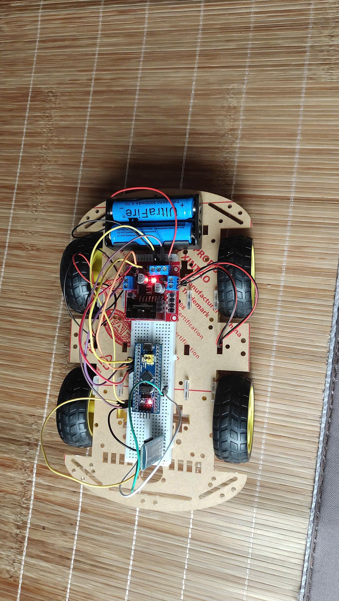

# Giới thiệu
- Dự án xe điều khiển qua bluetooth được lập trình trên chip stm32 sử dụng phần mềm stm32cube_mx và KeilC
# Module sử dụng
- stm32f103C8
- động cơ vàng
- pin 18650
- mạch cầu H L298
- Module BLE HC06

  
